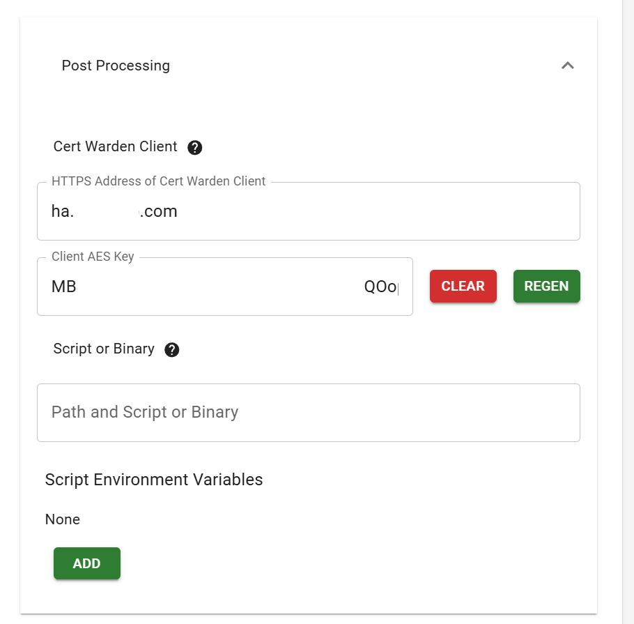

# Home Assistant Add-on: CertWarden client for Home Assistant

CertWarden client add-on to retrieve and renew certs for Home Assistant from local CertWarden service (https://www.certwarden.com)

This add-on retrieves certificate from CertWarden service, installs it in **/ssl** folder where Home Assitant can use it for HTTPS protocol.

After the inital certificate installation, the add-on start listening on port 5055/tcp for certificate updates from a CertWarden server. 


## How to use

After installation, first step is to fill the Configuration options:

### Configuration options

- **Server:** DNS name of the server. Must start with https and have a valid ssl certificate. (E.g. "https://certwarden.example.com:4055")
- **Server Communication key:** base64 raw url encoding of AES key used for communication between server and client. To generate the key, you need open your certificate in CertWarden: 
  - Go to **Certificates** -> **_\<certificate name\>_**
  - Scroll down to **Post Processing** section and expand it.
  - Click **Generate** button.
  - Copy **Client AES Key** value - this is your Server Communication key.
  - Fill **HTTPS Address of CertWarden Client** field with Home Assistant server name _(e.g. homeassistant.example.com)_. That will tell CertWarden where to send signal when certificate is updated.
  
- **Certificate name:** Name of certificate to retrieve from CertWarden (from CertWarden certificate page).
- **Key name:** Name of certificate key to retrieve from CertWarden (from CertWarden key page)
- **Certificate API key:** Certificate API key (from CertWarden certificate page)
- **Private API key:** Private key API key (from CertWarden key page)
- **Update window start time:** 24-hour time when window opens to write key/cert updates to filesystem. Default is "03:00" (3:00am).
- **Update window end time:** 24-hour time when window closes to write key/cert updates to filesystem. Default is "05:00" (5:00am).

### First start

The add-on will try to retrieve the certificate right away and compare it with the one installed in **/ssl** directory. If there is no local certificate present, or it doesn't match retrieved, the add-on will update the Home Assistant certificate.

After that, the add-on starts to listen on port 5055/tcp for certificate updates from a CertWarden server.
When CertWarden updates the certificate, it sends new information to add-on automatically.

> **Important:** Home Assistant doesn't use new certificate without a restart. The add-on won't restart HA automatically, so you need to do that manually. Normally, certificates are renewed about a month before expiration date so you would have enought time.

### Enable SSL in Home Assistant

If this is your first time using certificates with Home Assistant, you need to update HA _**configuration.yaml**_ file and add the following code:

```yaml
http:
  ssl_certificate: /ssl/fullchain.pem
  ssl_key: /ssl/privkey.pem
```

The easiest way to do that is by installing [Studio Code Server](https://github.com/hassio-addons/addon-vscode) add-on and edit _configuration.yaml_ file there.